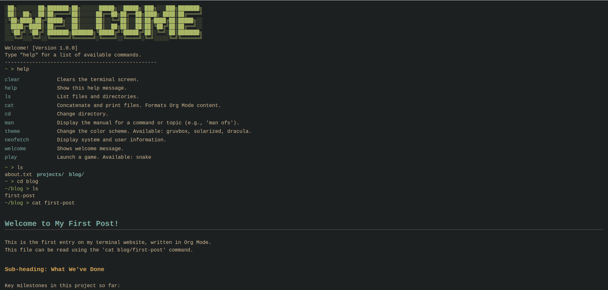

# TerminalFolio: A Developer-Centric Terminal Website

Welcome to TerminalFolio, a personal portfolio and blog built to emulate a modular, extensible Linux terminal. This project is written in React and designed with a core philosophy inspired by Emacs: a small, stable core responsible for state and rendering, extended by pluggable, independent modules (commands and games).

This document serves as the developer's guide to the architecture.



---

## 🚀 Getting Started (Local Development)

To get a local copy up and running, follow these simple steps.

1.  **Clone the repository:**
    ```bash
    git clone [https://github.com/ofsahof/terminal-blog.git](https://github.com/ofsahof/terminal-blog.git)
    cd terminal-blog
    ```
2.  **Install dependencies:**
    ```bash
    npm install
    ```
3.  **Run the development server:**
    ```bash
    npm run dev
    ```
    The project will be available at `http://localhost:5173/` (or another port if 5173 is in use).

## 📁 Directory Structure

The `src` directory is organized by responsibility.

- src/
  - `App.jsx` - The View Controller (Core Shell)
  - `main.jsx` - App entry point
  - `App.css` - Global styles for the terminal UI
  - `index.css` - CSS variables for themes
  - **commands/** - All pluggable terminal commands
    - `index.js` - The Command Registry (registers all commands)
    - `cat.jsx` - (UI Command) Renders file content
    - `ls.jsx` - (UI Command) Renders file list
    - `help.jsx` - (UI Command) Renders command list
    - `cd.js` - (State Command) Changes VFS path
    - `play.js` - (State Command) Changes app view
    - `...` - Other commands...
  - **games/** - All pluggable games
    - `index.js` - The Game Registry (registers all games)
    - `SnakeGame.jsx` - The Snake game component
  - **hooks/** - Custom React Hooks
    - `useTerminal.jsx` - The "Brain" (Core Logic & State)
  - **utils/** - Pure, non-stateful helper functions
    - `filesystem.js` - The Virtual File System (VFS) data
    - `formatOrgMode.jsx` - A UI helper to parse .org text to JSX
    - `pathHelper.js` - VFS path resolution logic
  - **content/** - Static content (not bundled)
    - **posts/**
      - `first-post.js` - (Legacy file, to be refactored)

---

## 🏛️ Architectural Deep Dive

The architecture is designed to be **decoupled**. The "Core" knows nothing about specific commands or games. It only knows how to *manage registries* and *handle state*.

### 1. The Core: `App.jsx` + `useTerminal.jsx`

* **`App.jsx` (The Shell / View Controller):**
    * This component has **no terminal logic.**
    * Its **only** job is to control the "Application View" state (`view: 'terminal' | 'game'`).
    * It imports the `gameRegistry` and renders either the `Terminal` component or the correct `GameComponent` based on the `view` state.
    * It passes the `initialHistory` (from `welcomeMessage`) and the `onViewChange` callback down to the `useTerminal` hook.

* **`useTerminal.jsx` (The Brain / Core Logic):**
    * This custom hook manages **all terminal state**:
        * `history`: The array of lines displayed on the screen (can be strings or JSX).
        * `command`: The text currently in the input.
        * `path`: The current VFS path (e.g., `~/projects`).
        * `commandHistory`: The array of past commands for Arrow Key navigation.
    * It accepts props from `App.jsx` to remain decoupled:
        * `onViewChange`: A callback to tell `App.jsx` to change the view (e.g., when `play` is run).
        * `initialHistory`: The content to show on load and after `clear`.
    * It returns all the necessary state and handlers for `App.jsx` to render the UI.

### 2. The Command Lifecycle (Critical Concept)

This is the most important piece of the architecture. **Not all commands are treated equally.** `useTerminal.jsx`'s `handleCommand` function splits them into two categories:

#### Category 1: State-Changing Commands (e.g., `cd`, `clear`, `play`)

* **Job:** To change the application's state, *not* to print a simple line of text.
* **Mechanism:** They return a special **signal object** (e.g., `{ isPathUpdate: true, newPath: '...' }` or `{ isViewChange: true, ... }`).
* **Execution Flow:** `handleCommand` checks for these signal objects in an `if/else if` chain. If found, it performs the state-changing action (like `setPath(result.newPath)`) and **`return`s from the function immediately.**
* This prevents the command from being processed like a "normal" command.

#### Category 2: Content-Rendering Commands (e.g., `ls`, `cat`, `help`)

* **Job:** To return content (a `string` or `JSX`) that should be printed to the screen.
* **Mechanism:** They return the content directly (e.g., `return <div>...</div>` or `return 'file.txt'`).
* **Execution Flow:** If a command is not a "State Changer," `handleCommand` assumes it's a "Content Renderer." It proceeds to the end of the function, where it appends *both* the user's input (the prompt) and the `result` from the command to the `history` state.

This distinction is what allows `clear` (which modifies the *entire* history) and `ls` (which just *adds to* the history) to coexist.

### 3. The "Pluggable" Module System (The "Emacs Philosophy")

The Core (`useTerminal.jsx`) is completely decoupled from the commands it runs.

* **`src/commands/index.js` (The Command Registry):**
    * This file imports all individual command modules (like `cat.jsx`, `cd.js`).
    * It exports a single object: `export const commands = { cat, cd, ls, ... }`.
    * `useTerminal.jsx` imports this *one* `commands` object. When a user types `ls`, it just looks up `commands[ls]` and runs its `.execute()` function.

* **`src/games/index.js` (The Game Registry):**
    * This file does the exact same thing for games.
    * `App.jsx` imports this `gameRegistry` to find which game component to render when `play` is run.

### 4. The Virtual File System (VFS)

The VFS is also split by responsibility:

* **`src/utils/filesystem.js` (The Data):**
    * This file contains **only** the `const filesystem` object.
    * It is a pure JSON-like structure defining the directories and files.
    * **Crucially:** It does *not* contain the *content* of files. (Or it shouldn't, see Roadmap).

* **`src/utils/pathHelper.js` (The Logic):**
    * This file contains pure functions for navigating the VFS.
    * `resolvePath(path, currentPath)`: Solves relative paths (like `..` or `blog/post`).
    * `findEntry(path, filesystem)`: Safely finds a file or directory in the VFS from a resolved path.

### 5. Theming Engine

Theming is simple and global:
1.  `src/index.css` defines CSS variables (`--bg`, `--fg`, `--red`, etc.) inside `body.theme-dracula`, `body.theme-gruvbox`, etc.
2.  The `theme.js` command's `execute` function changes the class on the `document.body` tag.
3.  All components (`cat.jsx`, `SnakeGame.jsx`, etc.) use `var(--red)` in their styling instead of hard-coded colors, making them instantly theme-aware.

---

## 💡 How to Contribute (Developer Rules)

To maintain this architecture, follow these rules:

### Rule 0: Linting and Formatting

This project uses ESLint and Prettier to enforce code style and catch potential errors. Please run the following commands before committing your changes to ensure consistency:

* **Automatically format code:**
    ```bash
    npm run format
    ```
* **Automatically fix lint errors:**
    ```bash
    npm run lint:fix
    ```
* **Check for remaining lint errors:**
    ```bash
    npm run lint
    ```
    *(This command should report no errors or warnings after running the `fix` commands.)*

### Rule 1: How to Add a New Command

1.  **Decide its type (JS vs. JSX):**
    * Will it return *only* a string, a number, or a signal object?
        * Use **`.js`** (e.g., `cd.js`, `theme.js`).
    * Will it return *any* JSX (e.g., `<div>`, `<span>`, a React component)?
        * Use **`.jsx`** (e.g., `ls.jsx`, `cat.jsx`, `help.jsx`).
2.  Create your file (e.g., `src/commands/mycommand.js`).
3.  Implement the command's `execute(args, context)` function.
    * `args`: An array of arguments (e.g., `['file.txt']`).
    * `context`: An object containing helper data from the core (e.g., `context.currentPath`, `context.allCommands`).
4.  Register your command in `src/commands/index.js`.

### Rule 2: How to Add a New Game

1.  Create your game component in `src/games/MyGame.jsx`.
2.  The component **must** accept an `onExit` prop (a function).
3.  Your component **must** listen for the 'Escape' key and call `onExit()` when it's pressed.
4.  Register your game in `src/games/index.js` (e.g., `mygame: MyGame`).
5.  **Done.** The `play mygame` command will now work automatically.

## 🗺️ Future Roadmap

The core architecture is now stable and the content loading mechanism is **production-ready**. All content is decoupled from the code bundle and loaded asynchronously using `fetch`.

The next steps focus on expanding the terminal's capabilities into a "Living Platform":

* **A) Connect to the Outside World (API Integration):**
    * `github`: A command to fetch and list public repositories from the GitHub API.
    * `weather`: A command to get the weather for a specified city.
    * `fetch`: A `curl`-like command to make GET requests to any public API and print the JSON response.

* **B) Create In-Terminal Applications:**
    * `grep` & Pipe Support (`|`): Refactor `handleCommand` to support piping output from one command (like `cat`) to another (like `grep`).
    * `nano` / `vim`: Create a full-screen text editor view (like `play` command) to edit VFS files (temporarily).

* **C) Make the VFS Persistent:**
    * `mkdir`, `touch`, `rm`: Add commands that can modify the VFS structure in memory.
    * `localStorage`: Use `localStorage` to save the user's VFS changes, so they persist after a page refresh.

* **D) Deployment:**
    * **Dockerize:** Create a `Dockerfile` to containerize the application for consistent production deployment.